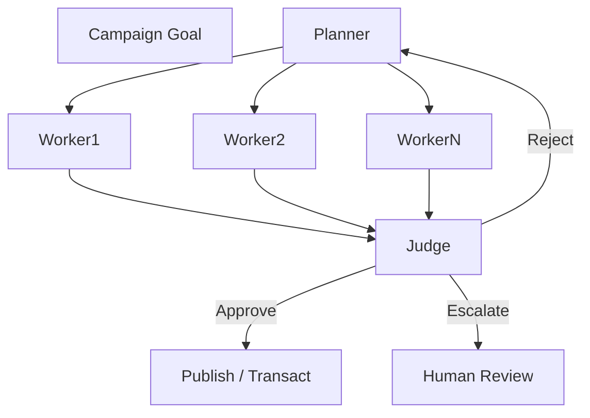
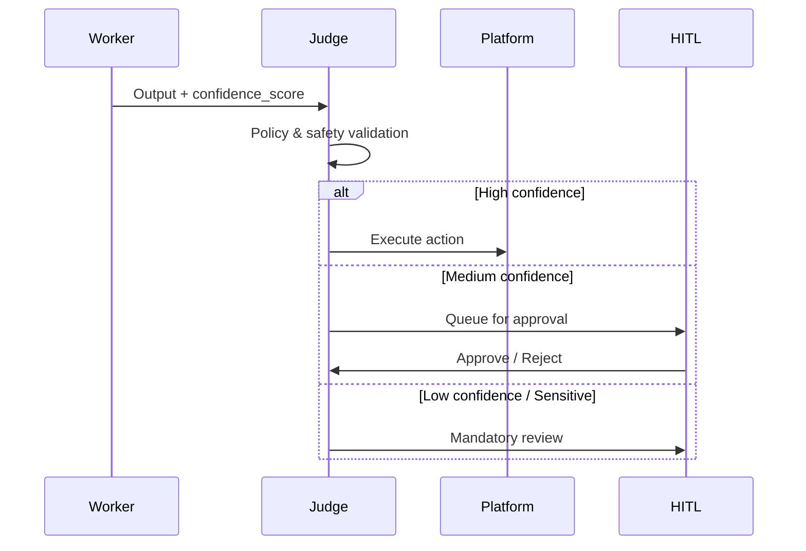
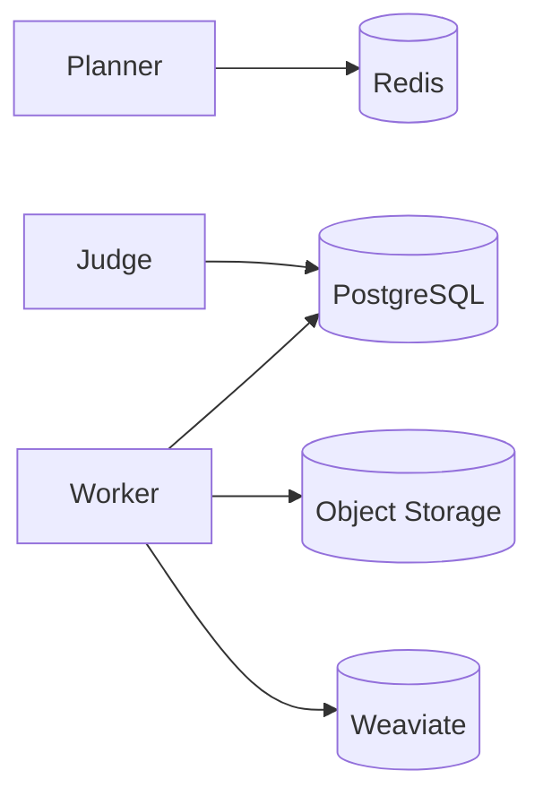

# Project Chimera - Architecture Strategy

## Overview

This document captures the **Architecture Strategy** for Project Chimera. It is concise and implementation-oriented to serve as architectural ground truth.

---

## 1. Agent Pattern

### Selected Pattern: **Hierarchical Swarm (Planner–Worker–Judge)**

#### Rationale

* Supports **thousands of autonomous agents** without central bottlenecks
* Separates concerns: strategy, execution, and governance
* Enables parallelism while preserving control
* Aligns with Model Context Protocol (MCP) and Agentic Commerce

#### Role Definitions

* **Planner Agent**

  * Interprets campaign goals
  * Decomposes goals into a DAG of tasks
  * Dynamically replans on failures or context changes

* **Worker Agents**

  * Stateless and ephemeral
  * Execute single atomic tasks (generate content, reply, render media)
  * Use MCP Tools exclusively for external actions

* **Judge Agents**

  * Validate outputs against persona, safety, and policy
  * Enforce Optimistic Concurrency Control (OCC)
  * Decide: Approve, Reject, or Escalate

---

## 2. Human-in-the-Loop (HITL) Safety Layer

### Design Principle

**Human review is exception-based, not default.**

Humans intervene only when confidence or risk thresholds require it.

### HITL Placement

* Humans sit **after the Judge**, before irreversible actions
* No human involvement between Planner and Worker

### Approval Logic

| Condition                            | Action                 |
| ------------------------------------ | ---------------------- |
| Confidence > 0.90 and non-sensitive  | Auto-approve           |
| Confidence 0.70–0.90                 | Async human approval   |
| Confidence < 0.70 or sensitive topic | Mandatory human review |

---

## 3. Data Architecture

### Strategy: **SQL-First with Polyglot Support**

#### Primary Source of Truth

* **PostgreSQL**
* Stores:

  * Video and content metadata
  * Content lifecycle states
  * Financial references and audit trails

#### Supporting Datastores

* **Redis**: task queues, short-lived state
* **Object Storage (S3/GCS)**: raw media assets
* **Vector DB (Weaviate)**: semantic memory and persona context

### Rationale

* Strong consistency required for finance and reporting
* Easier reconciliation across systems
* Lower long-term operational risk than NoSQL-only designs

---

## 4. Integration Layer

* All external systems accessed **only via MCP**
* No direct API calls inside agent logic
* MCP provides:

  * Tool abstraction
  * Resource polling
  * Governance, logging, and rate limits

---

## 5. Key Architectural Guarantees

* Scalability via horizontal Worker pools
* Safety enforced by Judge + HITL
* Financial and content actions are auditable
* Clear separation of reasoning, execution, and control

---

## 6. Implementation Assumptions

* Kubernetes-based deployment
* Stateless Planner, Worker, Judge services
* Redis-backed task queues
* GitOps-managed persona and policy files

---

