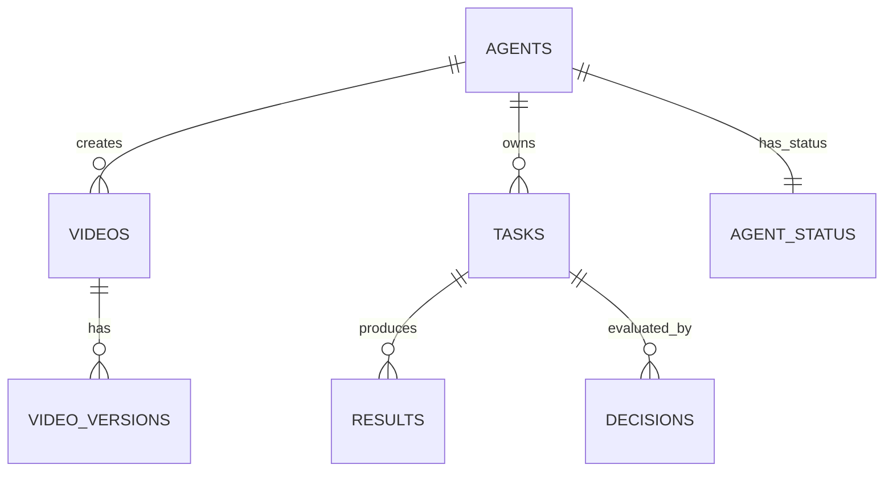

## Technical Specifications

### Agent API Contracts

#### Task (Planner → Worker)

```json
{
  "task_id": "uuid",
  "task_type": "generate_content | reply | render_video | transact",
  "priority": "high | medium | low",
  "context": {
    "goal": "string",
    "persona_constraints": ["string"],
    "resources": ["mcp://resource/path"]
  },
  "created_at": "ISO-8601 timestamp"
}
```

#### Result (Worker → Judge)

```json
{
  "task_id": "uuid",
  "output": "string | media_url",
  "confidence_score": 0.0,
  "metadata": {
    "model": "string",
    "latency_ms": 0
  }
}
```

#### Decision (Judge → Orchestrator)

```json
{
  "task_id": "uuid",
  "decision": "approve | reject | escalate",
  "reason": "string"
}
```

---

### Database Schema (Video Metadata)

**Primary Store: PostgreSQL**

Entities:

* **agents**

  * id (uuid, PK)
  * name
  * persona_ref

* **videos**

  * id (uuid, PK)
  * agent_id (FK → agents.id)
  * platform
  * status (draft | approved | published | failed)
  * duration_seconds
  * created_at

* **video_versions**

  * id (uuid, PK)
  * video_id (FK → videos.id)
  * media_url
  * confidence_score
  * created_at

* **tasks**

  * id (uuid, PK, mirrors task_id)
  * agent_id (uuid, FK → agents.id)
  * task_type (generate_content | reply | render_video | transact)
  * priority (high | medium | low)
  * goal (text)
  * persona_constraints (jsonb or text[])
  * resources (jsonb or text[] of mcp:// URIs)
  * created_at (timestamp)

* **results**

  * id (uuid, PK)
  * task_id (uuid, FK → tasks.id)
  * output (text | media_url)
  * confidence_score (float)
  * model (text)
  * latency_ms (integer)
  * created_at (timestamp)

* **decisions**

  * id (uuid, PK)
  * task_id (uuid, FK → tasks.id)
  * decision (approve | reject | escalate)
  * reason (text)
  * decided_at (timestamp)

* **agent_status**

  * agent_id (uuid, PK, FK → agents.id)
  * state (idle | working | awaiting_review)
  * capabilities (text[])
  * confidence_avg (float)
  * current_bid_price (numeric, optional)
  * updated_at (timestamp)


